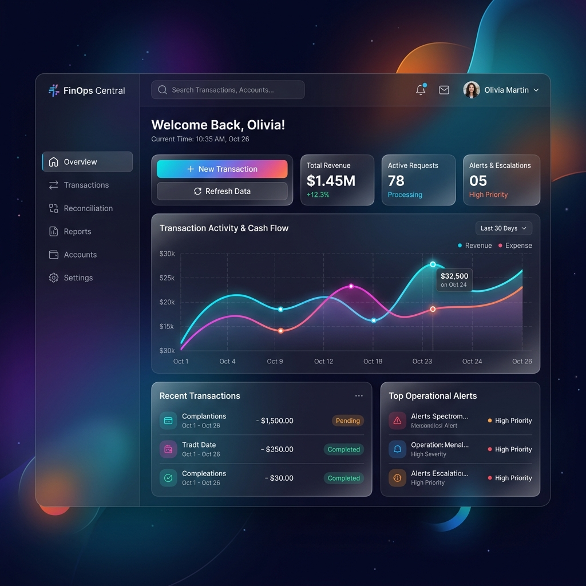

# Sarvam FinOps Agent ⚡🤖

[](https://vitejs.dev/)
[](https://reactjs.org/)
[](https://tailwindcss.com/)
[](https://www.sarvam.ai/)
[](https://opensource.org/licenses/MIT)

> **Autonomous AI-powered Finance Operations & CFO Co-Pilot** tailored for Indian Enterprises, Chartered Accountants, and SMBs. Powered by **Sarvam AI 2.0 LLM**, **Bulbul TTS**, and **Sarvam Vision Document OCR**.

---



---

## 🌟 Key Features

### 🏢 1. Executive CFO Dashboard
- **Real-time Analytics:** Instant overview of Total Revenue, Accounts Payable (AP), Accounts Receivable (AR), and Net Working Capital.
- **Visual Insights:** High-precision interactive charts powered by `Recharts` for revenue vs. expense breakdown.
- **Quick Action Bar:** One-click launch for voice query, invoice upload, and manual journal entry posting.

### 🎙️ 2. Sarvam Multilingual Voice CFO Assistant
- **Voice Queries in Indian Languages:** Voice-driven interaction using **Sarvam 2.0 LLM** & **Bulbul TTS** (Meera voice model) with fallback to Web Speech API.
- **Instant Financial Advisory:** Ask complex questions about GST compliance, month-end status, or vendor balances in Hindi (`hi-IN`) or English (`en-IN`).

### 🧾 3. Intelligent OCR Invoice Processing
- **Vision Document Extraction:** Automated image and PDF invoice scanning using **Sarvam Vision Document Parser**.
- **Tax & GSTIN Extraction:** Automatic parsing of CGST, SGST, IGST, taxable amounts, and vendor GSTIN verification (`27AAAA...`).
- **Risk Scoring:** Confidence score calculation and automated risk assessment before booking into Accounts Payable.

### ⚖️ 4. Automated Bank & Ledger Reconciliation
- **Smart Transaction Matching:** Automated pairing of bank feed line items with internal ERP general ledgers.
- **Match Confidence Index:** Match score percentage (e.g. 98% Match) based on reference IDs, vendor names, and amounts.
- **1-Click Reconciliation:** Instantly resolve matched items and clear pending reconciliation queues.

### 🚨 5. AI Anomaly & Fraud Detection
- **Tax Rate Mismatches:** Detects invalid HSN/SAC GST percentage charges (e.g., 18% charged instead of applicable 12%).
- **Duplicate & Outlier Detection:** Flag duplicate invoice submissions, unauthorized vendor bank detail changes, and unexpected expense spikes.
- **Actionable Remediation:** Suggested debit notes, supervisor escalation, and one-click dispute generation.

### 📔 6. Auto Double-Entry Journal Entry Generator
- **Chart of Accounts Mapping:** Generates balanced debit/credit journal vouchers (e.g., Debit Expense & Input Tax / Credit Accounts Payable).
- **Audit-Ready Ledger Posting:** Export or post directly into standard ERP formats (Tally, Zoho Books, SAP, QuickBooks).

### 📅 7. Month-End Close Automation
- **Interactive Close Checklist:** Track progress across AP lock, AR reconciliation, Fixed Asset Depreciation, Tax Provisioning, and Final Ledger Lock.
- **Progress Tracking:** Real-time completion progress bar with celebration effects on 100% close completion (`canvas-confetti`).

---

## 🏗️ Tech Stack & Architecture

- **Frontend Core:** React 18.3 + Vite 5
- **Styling:** Tailwind CSS 3 with custom glass-morphism dark theme tokens
- **Data Visualization:** Recharts
- **Icons & UI:** Lucide React
- **AI Integrations:**
  - **Sarvam Chat API (`sarvam-2b`):** Financial reasoning engine
  - **Sarvam Bulbul TTS (`bulbul:v1`):** Neural voice synthesis
  - **Sarvam Vision API (`document-parser`):** OCR invoice parsing
  - **Client-Side Smart Engine:** Fallback engine ensuring zero-downtime demos even without API key configuration

---

## 🚀 Quick Start & Installation

### Prerequisites
- **Node.js** >= 18.x
- **npm** >= 9.x

### Steps

1. **Clone the Repository**
   ```bash
   git clone https://github.com/unnati10mishra-prog/Sarvam-FinOps-Agent-.git
   cd Sarvam-FinOps-Agent-
   ```

2. **Install Dependencies**
   ```bash
   npm install
   ```

3. **Start Development Server**
   ```bash
   npm run dev
   ```
   Navigate to `http://localhost:5173` in your browser.

4. **Build for Production**
   ```bash
   npm run build
   ```

---

## 🔑 Sarvam AI API Key Setup (Optional)

The application features a built-in **Client-Side Fallback Engine** that works out-of-the-box for demonstrations. To connect live Sarvam AI cloud services:

1. Click the **🔑 API Key** button in the top navigation bar.
2. Enter your **Sarvam AI Subscription Key** (obtained from [Sarvam AI Dashboard](https://dashboard.sarvam.ai/)).
3. The key is securely saved in your browser's `localStorage` and used directly for live LLM, Speech, and Vision API requests.

---

## 📂 Project Structure

```text
Sarvam-FinOps-Agent-/
├── public/
├── src/
│   ├── components/
│   │   ├── AnomalyDetectionView.jsx    # Anomaly & tax mismatch detector
│   │   ├── ApiKeyModal.jsx             # Sarvam AI API Key modal
│   │   ├── Dashboard.jsx               # Executive main dashboard
│   │   ├── InvoiceProcessingView.jsx   # OCR Vision invoice upload & parser
│   │   ├── JournalEntriesView.jsx      # Double-entry journal voucher engine
│   │   ├── MonthEndCloseView.jsx       # Month-end closing checklist
│   │   ├── Navbar.jsx                  # Top navigation header
│   │   ├── ReconciliationView.jsx      # Bank & ERP ledger reconciliation
│   │   ├── Sidebar.jsx                 # Module navigation drawer
│   │   └── VoiceAssistantModal.jsx     # Sarvam AI Multilingual voice modal
│   ├── data/
│   │   └── initialData.js              # Mock financial transactions & ledgers
│   ├── services/
│   │   └── sarvamApi.js                # Sarvam AI SDK integration & fallback engine
│   ├── App.jsx                         # Main app routing & state layout
│   ├── index.css                       # Global Tailwind CSS & custom scrollbars
│   └── main.jsx                        # React root entry point
├── dashboard_mockup.jpg                # Project screenshot artifact
├── index.html                          # HTML shell
├── package.json                        # Node dependencies & scripts
├── postcss.config.js                   # PostCSS configuration
├── tailwind.config.js                  # Tailwind configuration
└── vite.config.js                      # Vite bundle configuration
```

---

## 🤝 Contributing

Contributions are welcome! If you'd like to improve the Sarvam FinOps Agent or add new integrations:
1. Fork the project.
2. Create your feature branch (`git checkout -b feature/AmazingFeature`).
3. Commit your changes (`git commit -m 'Add some AmazingFeature'`).
4. Push to the branch (`git push origin feature/AmazingFeature`).
5. Open a Pull Request.

---

## 📄 License

Distributed under the **MIT License**. See `LICENSE` for more information.

---

<p align="center">
  Made with ❤️ for <b>Sarvam AI FinOps Ecosystem</b>
</p>
